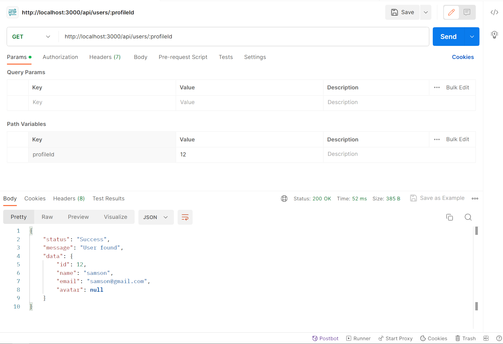

Creation of Endpoint to return user profile Information by profile ID

## Description

    - Endpoint:{api/users/:profileId}
    - Response:
          ```JSON
           {
               "status":"Success",
                "message": "User Found",
                "data":{
                    "id":profileId,
                    "name":USER_NAME,
                    "email":USER_EMAIL
                    "avater":USER-AVATER
                }
           }
            ```
    - Error Response:
           ```JSON
            {
                "status": "Failure",
                "error": ERR_MESSAGE
            }
            ```

## Related Issue

This is a new feature to be imlemented

## How Has This Been Tested?

Response and error response have been tested via POSTMAN

## Screenshots (if appropriate):



## Types of changes

- [x] New feature (non-breaking change which adds functionality)

## Checklist:

- [x] My code follows the code style of this project.
- [x] My change requires a change to the documentation.
- [x] I have updated the documentation accordingly.
- [x] I have read the **CONTRIBUTING** document.
- [x] I have added tests to cover my changes.
- [x] All new and existing tests passed.
